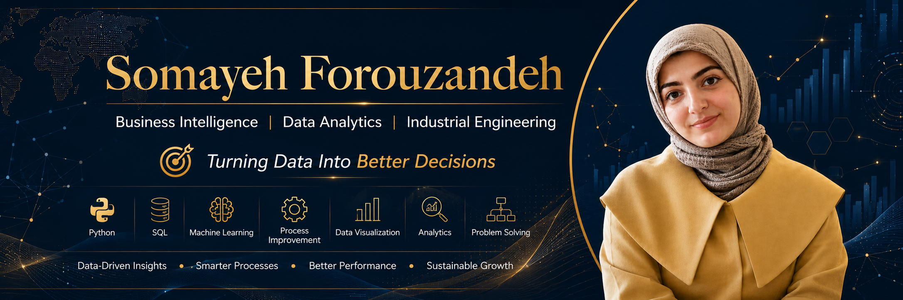

<h3 align="center">
Industrial Engineer (M.Sc.)
Business Intelligence | Data Analytics | Process Improvement
</h3>

Industrial Engineer with a Master's degree in Systems & Productivity, passionate about Business Intelligence, Data Analytics, Process Improvement, and AI-driven decision making. I build analytical solutions that transform data into actionable business insights

---

# 👋 About Me

🎓 MSc Industrial Engineering – Systems & Productivity

📊 Business Intelligence & Data Analytics Enthusiast

🏭 Industrial Engineering Professional focused on Process Improvement and Performance Management

📈 Passionate about transforming business data into actionable insights, optimizing processes, and supporting strategic decision-making through Business Intelligence and Analytics.

I combine my background in **Industrial Engineering** with modern **Business Intelligence and Data Analytics tools** to analyze data, improve processes, and support strategic decisions.

---

# 🎯 Core Expertise

## ⚙ Industrial Engineering

- Systems & Productivity
- Process Improvement
- Performance Management
- KPI Design
- Lean Six Sigma
- EFQM
- Balanced Scorecard (BSC)

## 📊 Business Intelligence

- Microsoft Power BI
- DAX
- Power Query
- Data Modeling
- Dashboard Design

## 📅 Project Management

- Primavera P6
- Project Planning & Control
- Scheduling
- Progress Monitoring

## 🐍 Data & AI

- Python
- Pandas
- Machine Learning Fundamentals
- Data Analytics

---

# 🛠 Tech Stack

## ⚙️ Industrial Engineering

## 📊 Business Intelligence

## 📅 Project Management

## 🐍 Programming & Data Analytics

## 🗄 Database

## 🤖 Artificial Intelligence & Machine Learning

---

# 🚀 Featured Projects

- 📊 **Power BI Sales Dashboard** — ✅ Available
- 🐍 **Python for Data Analytics** — 🚧 Coming Soon
- 🗄 **SQL Analytics** — 🚧 Coming Soon
- 🤖 **Machine Learning Projects** — 🚧 Coming Soon
- ⚙ **Process Improvement Projects** — 🚧 Coming Soon
- 📈 **Business Intelligence Solutions** — 🚧 Coming Soon

---

# 📊 GitHub Analytics

---

# 📫 Connect With Me

- GitHub: https://github.com/somayehforouzandeh
- LinkedIn: https://www.linkedin.com/in/somayeh-forouzandeh

---

> "Data is not just numbers; it is the foundation for better decisions, smarter processes, and sustainable improvement."
